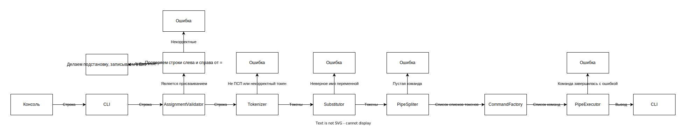

# Архитектура интерпретатора командной строки hsesh

## Команда
- Бубнов Данил
- Онофрийчук Илья
- Марьин Глеб
- Лучинин Алексей

## Компоненты

### Env
Отвечает за переменные окружения

Умеет:
- присвоить какой-то переменной значение
- сказать значение конкретной переменной
- отдать весь список переменных и их значений

### CLI
Отвечает за ввод и вывод в консоль

Умеет:
- считывать очередное выражение (строку)
- вернуть поток ввода
- вывести строку или поток байт в консоль

### AssignmentValidator
Отвечает за присваивания

Умеет:
- проверить, является ли выражение присваиванием
- вернуть переменную и присваиваемое значение

Алгоритм: если в выражении есть =, то разбиваем выражение по первому =; проверяем, является ли левая часть валидным именем переменной (с помощью [VarNameValidator](#varnamevalidator)), а правая валидным токеном (с помощью [Tokenizer](#tokenizer))

Примеры корректных присваиваний:
- a=3dF_
- a=$b
- a=" = | ' $b "
- a=' = | " $b '
- a=3'3 3'3
- a=" 3 3 "
- a=' 3 3 '
- a=' $b '" $b "' 3 '
- a=3'|'
- a=3"="

Примеры некорректных присваиваний:
- a= 3
- a =3
- a = 3
- a=3"
- a=3'
- a='3
- a="3
- a=3|
- a=3=
- a=3 3
- a=$b b
- a=" 3 "|' 3 '

### Tokenizer
Отвечает за разбиение на токены

Умеет:
- разбить выражение на токены

Токен -- это одно из:
- |
- '[^']*'
- "[^"]*"
- [^'"|=]+
- конкатенация последних трех

Примеры корректных токенов:
- |
- '3 = | "$a" $a '
- "3 = | '$a' $a "
- Lesha9
- 9'='3"^"2
- 9'='9
- "9="9
- "3""4"

### Substitutor
Отвечает за подстановку переменных

Умеет:
- заменить переменные в токене на их значения и убирает кавычки

Правила такие же, как в bash

Примеры подстановок (a=9):
- '3 = | "$a" $a' не изменится
- "3 = | '$a' $a" -> 3 = | '9' 9
- Lesha$a -> Lesha9
- "$ab" -> пустая строка
- "$a=b" -> 9=b
- "$a|b" -> 9|b

### PipeSpliter
Отвечает за разбиение пайпа на команды (списки токенов)

Умеет:
- поделить список токенов по токену |

### CommandFactory
Отвечает за создание команд

Умеет:
- зарегистрировать свою команду (cat, echo, ...)
- сделать из списка токенов команду

Если название команды зарегистрировано, то возвращает нашу реализацию, которой передаются аргументы, иначе будет подготовлен к запуску системный процесс, будут проставлены переменные окружения для него (нужен доступ к [Env](#env))

Итоговая команда имеет метод run(InputStream, OutputStream, ErrorStream)

### PipeExecutor
Отвечает за исполнение пайпа (пайп == список команд)

Умеет:
- Исполнить пайп

Исполняет последовательно, направляет вывод одной команды на вход следующей

### VarNameValidator
Отвечает за валидацию имен переменных

Умеет:
- проверить, является ли строка валидным именем переменной
- найти длину валидного имени переменной в строке, начиная с начала строки (у "ab3 a" длина равна 3)

Имя валидное, если подходит под регулярное выражение [_a-zA-Z][_a-zA-Z0-9]*

### MainExecutor
Отвечает за объединение всех компонентов

0. Регистрирует команды cat, echo, ... в [CommandFactory](#commandfactory)
1. Просит у [CLI](#cli) очередное выражение
2. Спрашивает у [AssignmentValidator](#assignmentvalidator), является ли выражение присваиванием
    - Если является, то записываем в [Env](#env) значение и переходим к шагу 1
    - Если не является, то идем дальше
3. Передает [Tokenizer](#tokenizer) выражение, он возвращает нам список токенов
4. Заменяет в каждом токене переменные с помощью [Substitutor](#substitutor)
5. Бьет список токенов на списки токенов (будущие команды) с помощью [PipeSpliter](#pipespliter)
6. Превращает списки токенов в команды с помощью [CommandFactory](#commandfactory)
7. Просит у [CLI](#cli) поток ввода, вывода и ошибок, передает их и список команд на исполнение [PipeExecutor](#pipeexecutor)
8. Переходит к шагу 1

То же самое в виде диаграммы


## Примеры работы

```cat example.txt | wc```

Разбор:
1. CLI возвращает MainExecutor *cat example.txt | wc*
2. AssignmentValidator говорит, что это выражение не является присваиванием
3. Tokenizer из *cat example.txt | wc* получает [*cat*, *example.txt*, *|*, *wc*]
4. Substitutor ничего не изменяет
5. PipeSpliter из [*cat*, *example.txt*, *|*, *wc*] получает [[*cat*, *example.txt*], [*wc*]]
6. CommandFactory из [*cat*, *example.txt*], [*wc*]] получает [*CatCommand*, *WcCommand*]
7. PipeExecutor исполняет команду *CatCommand*, ее вывод ("Some example text") передаёт команде WcCommand, выполняет ее, и она выводит в OutputStream *1 3 18*

```FILE=example.txt```

Разбор:
1. CLI возвращает MainExecutor-у *FILE=example.txt*
2. AssignmentValidator говорит, что это выражение является присваиванием. MainExecutor модифицирует Env: в переменную *FILE* записываем значение *example.txt*


```cat $FILE```

Разбор:
1. CLI возвращает MainExecutor *cat $FILE*
2. AssignmentValidator говорит, что это выражение не является присваиванием.
3. Tokenizer из *cat $FILE* получает [*cat*, *$FILE*]
4. Substitutor из [*cat*, *$FILE*] получает [*cat*, *example.txt*]
5. PipeSpliter из [*cat*, *example.txt*] получает [[*cat*, *example.txt*]]
6. CommandFactory из [[*cat*, *example.txt*]] получает [*CatCommand*]
7. MainExecutor получает от CLI поток ввода, передает его и список команд [*CatCommand*] на исполнение PipeExecutor. PipeExecutor вызывает метод *run* у *CatCommand* и она выводит в OutputStream *Some example text*